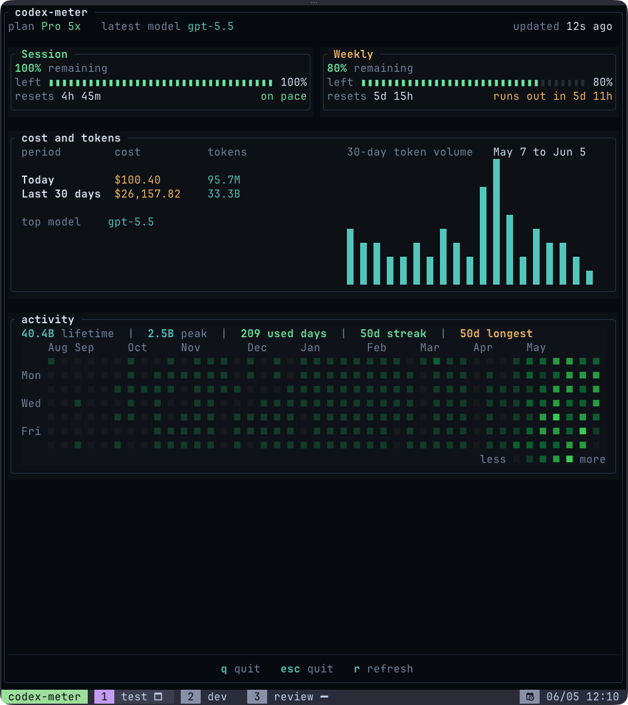

# codex-meter

`codex-meter` is a lightweight terminal dashboard for Codex usage.

It shows remaining quota, reset timing, token volume, estimated cost, and activity history using Codex account data and local Codex session data.



## Features

- Session and weekly quota remaining
- Reset timing and pace status
- Today and 30-day token totals
- Estimated today and 30-day cost
- Top model
- Token activity calendar
- Used days, current streak, and longest streak

## Requirements

- macOS
- Codex signed in on the same machine

## Install

### Homebrew

```sh
brew install h3nock/tap/codex-meter
```

### GitHub Releases

Download the latest macOS archive from the releases page:

```text
https://github.com/h3nock/codex-meter/releases/latest
```

Extract it and move the binary somewhere on your `PATH`:

```sh
mkdir -p ~/.local/bin
tar -xzf codex-meter-v*-macos-*.tar.gz
install -m 0755 codex-meter ~/.local/bin/codex-meter
```

### From Source

Requires Rust and Cargo.

```sh
cargo install --git https://github.com/h3nock/codex-meter
```

From a local checkout:

```sh
cargo install --path .
```

## Usage

```sh
codex-meter                         # open the dashboard
codex-meter --once                  # print one snapshot and exit
codex-meter --codex-home PATH       # use a different Codex home
codex-meter alias status            # check whether cm is available
codex-meter alias create            # create cm next to codex-meter
codex-meter alias create --bin-dir PATH  # create cm in a custom bin directory
```

Aliases refuse to overwrite another command.

## Data and Accuracy

`codex-meter` reads Codex auth and session data under `~/.codex`. Quota and activity are fetched from your Codex account. Token volume and cost are computed from local Codex session data.

Cost is an estimate. Unknown models are left unpriced.

`codex-meter` does not write auth files, refresh tokens, parse prompt/response text, or display account identifiers.

## Development

```sh
cargo fmt --check
cargo test
cargo clippy --all-targets -- -D warnings
cargo build --release
```

## License

MIT
